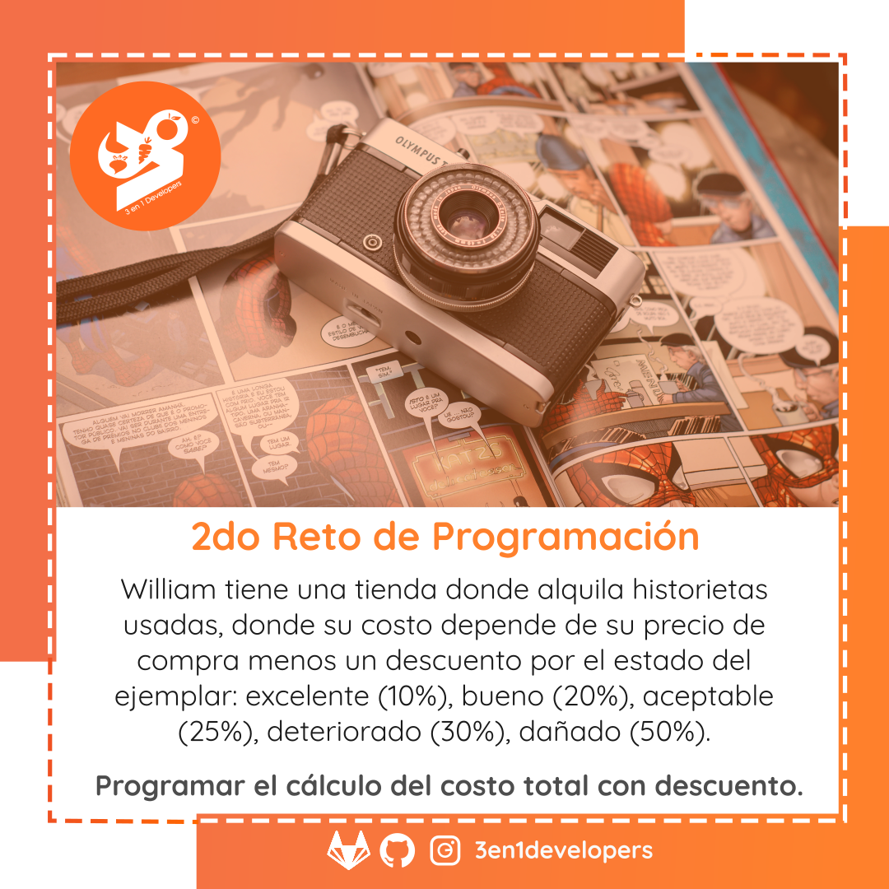

# Comic Rental

## 2do Reto de Programación



William tiene una tienda donde alquila historietas usadas, donde su costo depende de su precio de compra menos un descuento por el estado del ejemplar: excelente (10%), bueno (20%), aceptable (25%), deteriorado (30%), dañado (50%).

**Programar el cálculo del costo total con descuento.**

## Características ❤️

¡En construcción!

## Pendientes

¡En construcción!

## Galería 📖

¡En construcción!

## Ejecución 🚀

¡En construcción!

## Herramientas 🛠️

¡En construcción!

### Instalación 🔧

A continuación les dejamos el paso a paso de la instalación de las herramientas necesario para el ambiente de desarrollo:

#### Paso 1. Instalar node.js

Para ello puedes acceder al sitio oficial de Node.js y descargar el instalador.

#### Paso 2. Instalar dependencias del proyecto

```
npm install
```
Manual
```
npm install -g jest
```

#### Paso 3. Ejecutar las pruebas

```
npm run test
```

## Flujo de Ramas

### Git Flow en GitLab

##### Ramas Principales:

**main** 

**develop**

```
git checkout -b develop
git push origin develop
```

##### Ramas Secundarias:

```
git checkout -b feature/calcular-descuento
git push origin feature/calcular-descuento
```

#### Extensiones:
**Git Graph**, permite visualizar gráficamente la ramificación del repositorio

## Créditos

### Autores ✒️

* **Achique Luis** - *Software Developer* - [achique-luisdan](https://gitlab.com/achique-luisdan)

También puedes mirar la lista de todos los [contribuyentes](https://gitlab.com/3en1developers/avg-bateo/contributors) quíenes han participado en este proyecto. 

### Recursos 📄

#### Ilustración del reto: 

Wallace Chuck en <a href="https://www.pexels.com/photo/retro-camera-on-comic-book-3744196/">Pexels</a>

#### Avatar del repositorio:  

Harryarts en <a href="https://www.vecteezy.com/vector-art/246970-beautiful-six-empty-comic-book-pages-colorful-design">Vecteezy</a>